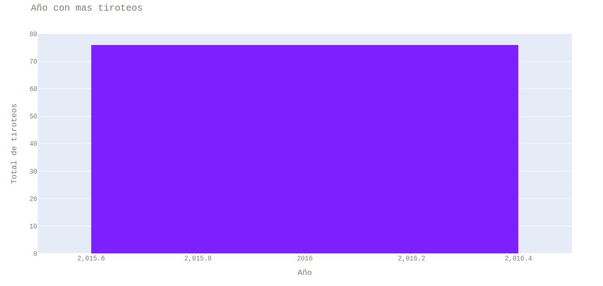

# Practica 1 - Seminario 2 (Spark)

## Descripcion

Debido a que la propuesta a implementar tiene que ser una solución de procesamiento en memoria, se le proporcionará únicamente información acerca de las ventas del negocio en un periodo dado para que realice las pruebas sobre estos datos. Se utilizará Apache Spark como el software que le permite realizar el procesamiento de grandes cantidades de datos en clusters de memoria y el lenguaje de programación Python, dada la cantidad de librerías disponibles para operaciones matemáticas que este lenguaje posee.

## Herramientas utilizadas

- Python 2.7.17
- IDE Pycharm-Community 2018.2.4
- Ubunto 18.04
- Spark 2.4.5

## Transformaciones RDD utilizadas

| Transformacion                 | Descripcion                                                                                                                                                              |
| ------------------------------ | ------------------------------------------------------------------------------------------------------------------------------------------------------------------------ |
| **map(func)**                  | Devuelve un nuevo conjunto de datos distribuido formado al pasar cada elemento de la fuente a través de una función func.                                                |
| **filter(func)**               | Devuelve un nuevo conjunto de datos formado seleccionando aquellos elementos de la fuente en los que func devuelve verdadero.                                            |
| **flatMap(func)**              | Similar a **map**, pero cada elemento de entrada se puede asignar a 0 o más elementos de salida (por lo que func debería devolver una Seq en lugar de un solo elemento). |
| **distinct([numPartitions]))** | Devuelve un nuevo conjunto de datos que contiene los distintos elementos del conjunto de datos de origen.                                                                |

## Acciones RDD utilizadas

| Accion                        | Descripcion                                                                                                                                                                                                                    |
| ----------------------------- | ------------------------------------------------------------------------------------------------------------------------------------------------------------------------------------------------------------------------------ |
| **collect()**                 | Devuelva todos los elementos del conjunto de datos como una matriz en el programa del controlador. Esto suele ser útil después de un filtro u otra operación que devuelve un subconjunto suficientemente pequeño de los datos. |
| **first()**                   | Devuelve el primer elemento del conjunto de datos (similar a take (1)).                                                                                                                                                        |
| **takeOrdered(n,[ordering])** | Devuelva los primeros n elementos del RDD utilizando su orden natural o un comparador personalizado.                                                                                                                           |

## Reportes

Al ejecutarse el script deberá dar como resultado una gráfica que se abra en el navegador.

Los reportes solicitados son los siguientes:

### Archivo suicide

#### Resultado de SuicideReport1

Gráfica de barras que muestre el total de suicidios de las siguientes

generaciones:

- Generation X
- Generation Z
- Boomers
- Silent
- G.I. Generation
- Millenials

#### Resultado de SuicideReport2

Gráfica de pie que muestre el total de suicidios por edades en Guatemala.

### Archivo premier_league

#### Resultado de PremierLeagueReport1

Gráfica de pie que compare el resultado de cada partido del equipo Manchester United de la temporada 2017-2018 (ganador del partido: H para el equipo local, A para el equipo visitante, D para el empate).

#### Resultado de PremierLeagueReport2

Gráfica de barras que muestre el total de goles fuera de casa (gol de visita) por club de la temporada 2012-2013.

### Archivo mass_shootings

#### Resultado de MassShootingsReport1

Gráfica de barra que reporte el año con más tiroteos.

#### Resultado de MassShootingsReport2

Gráfica de barra que reporte el año con más muertes.

#### Resultado de MassShootingsReport3

Gráfica a su elección, de muertes, heridos y total de víctimas del año 2015.

